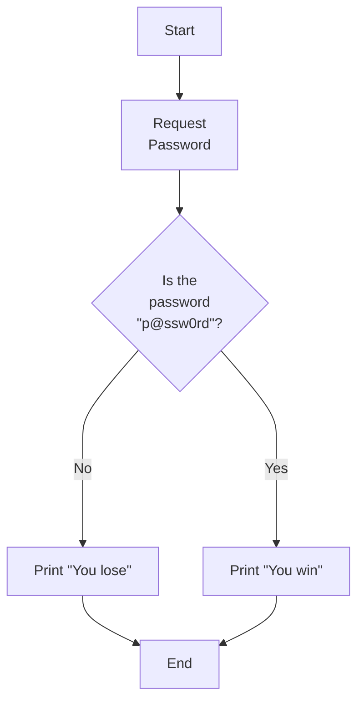

# S8 PROJECT REPORT
### Context (what’s RISC-V)
 
We advise the reader to be familiar with the RISC-V ISA before reading this report.
Reading the [Beginner's Guide to RISC-V](https://github.com/NeoKaios/neorv32_shadow_stack/blob/master/Beginner's%20Guide%20to%20RISC-V.pdf) can be an option.


### I – Building and Implementation of the RISC-V CPU into the FPGA

#### Vivado & LiteX installation

Warning: Vivado is a big software: 40Go, make sure you are connected via Ethernet.

Install [LiteX](https://github.com/enjoy-digital/litex/wiki#quick-start-guide): do the first three steps. I had to run ```sudo apt install meson``` to launch the command ```./litex_setup.py --gcc=riscv```

We advise that you run following command regularly during this installation, it will return some errors that should be the same as the one in this tutorial. ```./board_name.py --build``` in the file ```/path_to_litex/litex-boards/litex_boards/targets```.

Add the toolchain to the *PATH*, add the following command to ```.bashrc``` for instance:
```export PATH="/PATH_to_litex_setup/riscv-unknown-elf-gcc..../bin/:$PATH"```

#This should have resolved the error ```Unable to find toolchain```

Vivado installation:
Download [Vivado](https://www.xilinx.com/support/download.html) version 2019.1 (WebPack edition is lighter)
 
Source `settings64.sh` to use the ```vivado``` command.
Add it to ```.bashrc```: ```source /tools/Xilinx/Vivado/2019.1/settings64.sh```.

#This should resolve the error ```Unable to find Vivado```

In */lib/x86_64-linux-gnu/*:
Create this symbolic link ```sudo ln -s libtinfo.so.6 libtinfo.so.5```.
I later ran into a similar issue with libncurses during a simulation step in Vivado, the following command fixed it: ```sudo ln -s libncurses.so.6.2 libncurses.so.5```.

#This should solve the error regarding `libtinfo.so.5` absence


Now the ```--build``` command should run.
We can now try to run the ```./nom_de_la_board.py --load```

Install openocd: ```sudo apt install openocd```

I had several load errors such as:
```libusb_open() failed with LIBUSB_ERROR_ACCESS```
and ```Error: libusb_claim_interface() failed with LIBUSB_ERROR_BUSY```

But after a reboot of the PC, it works fine.

If the load works, we can launch the ```lxterm /dev/ttyUSB1```, you can use ```litex_term``` instead of ```lxterm```. It works best if we launch `lxterm` before the `--load` command.

#### Rocket Generator with LiteX

Using LiteX, one can choose the CPU to use with the ```--cpu``` option. With this option, we can choose rocket CPU to install on the board. This is good because there is a way to modify the CPU with the [Rocket Chip Generator](https://github.com/chipsalliance/rocket-chip) repo. You can modify the scala files in ```src/main/scala```.

By putting the newly generated verilog files into the [rocket repo for LiteX](https://github.com/litex-hub/pythondata-cpu-rocket). With some configuration tweaks, automatised thanks to the ```update.sh``` script, the LiteX rocket CPU should run with your new modification.


#### NEORV32

NEORV32 comes with a very detailed [documentation](https://stnolting.github.io/neorv32/) as well a wonderful [user guide](https://stnolting.github.io/neorv32/ug/). The information provided in this section are a summary of what the guide has to offer. However, we do encourage the reader to check out the guide.

We managed to build NEORV32 using both Linux and Windows devices.

##### Installation

Clone the repositories
```bash
git clone https://github.com/stnolting/neorv32-setups.git
git clone https://github.com/stnolting/neorv32.git
```

##### Building

There is a list of [Exemplary FPGA Board Setups](https://github.com/stnolting/neorv32-setups#setups-using-commercial-toolchains).
If your board is part of these setups, follow the instructions provided.

For instance, for the NEXYS A7: read vivado/nexys-a7-test-setup/README.md, launch the vivado command (batch mode), and then open then work/ repository as a vivado project.

The bitstream should already be generated but we can rerun everything by pushing *Generate Bitstream*.

##### Executing programs on the board

We recommend using [CuteCom](https://pkgs.org/download/cutecom) on Linux and [microST](https://pypi.org/project/microst/) on Windows, a tool developed by [us](https://github.com/Garfield1002/microst), to communicate with the board.

Once the board flashed with the .bit and the serial connection established, one should see the bootloader sequence.

```shell
<< NEORV32 Bootloader >>

BLDV: Feb 16 2022
HWV:  0x01060709
CLK:  0x05f5e100
ISA:  0x40901107 + 0xc000068b
SOC:  0x7b7f402f
IMEM: 0x00008000 bytes @0x00000000
DMEM: 0x00004000 bytes @0x80000000

Autoboot in 8s. Press any key to abort.
```
Follow the [section 4](https://stnolting.github.io/neorv32/ug/#_application_program_compilation) and [5](https://stnolting.github.io/neorv32/ug/#_uploading_and_starting_of_a_binary_executable_image_via_uart) of the user guide to run any program on the board.
 
### II – Development and implementation of the attack:

After having installed the RISC-V CPU on the FPGA boards, our next goal was to develop an attack to highlight its vulnerability to buffer overflow attacks. In order to do that, we had to understand how the exploit works and then design a vulnerable code that we would execute on the board.

#### Buffer Overflow attacks.

A buffer overflow occurs when a program writes more data to a fixed size block of memory, called buffer, than the buffer was allocated to hold. If this happens, adjacent memory areas get overwritten.

Buffer overflows can cause issues as the program might not work the way it was intended to. Indeed, the overwritten memory areas might be important for the correct execution of the program.

An attacker can use buffer overflows in order to overwrite key memory locations with a desired value.

A simple attack could consist of modifying a variable. However, buffer overflows can also be used to alter the control flow. Indeed, if the attacker manages to modify the return address, he will be able to jump to any desired area in the code.

For instance, an attacker could overwrite the return address in order to make it point to another function in the code. In some cases, if the stack is executable, then the attacker could even inject a malicious code such as a shellcode and make the return address point to it. This allows the attacker to execute any desired instructions, rather than only the code already present in the executable.


#### How the attack we conceived works

The following code can be found [here](https://github.com/NeoKaios/neorv32_shadow_stack/tree/master/sw/example/attack), this implementation is written for the NEORV32 CPU.

##### The auth and the success function

The program was imagined as a simple authentication system. An `auth` function requests a password from the user and compares it to the hardcoded password. If the password is correct, the `success` function is called.

```c=
/**
 * @brief Takes a 8 character password and verifies it
 *
 * @param password the user submitted password
 */
void auth(char *password)
{

    neorv32_uart0_print("In auth\n");
    /* Copies the password because security */
    char buffer[9];
    strcpy(buffer, password);

    if (strcmp(buffer, "p@ssw0rd") == 0)
    {
        success();
    }
    else
    {
        failure();
    }
    neorv32_uart0_printf("%s\nend auth\n", buffer);
}
```

```c=
/* The user authentication succeeded */
void success()
{
    neorv32_uart0_print("You win\n");
}
```

Notice that `auth` uses the _unsafe_ function `strcpy` rather than the recommended `strcpy_s`. This will be important later on.

##### Normal execution of the program

The program was intended to run as such:



##### The malicious function crafting

The hex code for the buffer overflow is stored [here](https://github.com/NeoKaios/neorv32_shadow_stack/blob/master/sw/example/attack/code).

The premise of the attack is quite simple. The password entered is larger than the size allocated for the buffer (`8` characters ad a null terminator).

When the unsafe `strcpy` function is called, it overwrites parts of the stack. If the password is long enough, we can overwrite the return address. 

The initial part of the malicious string `An old silent pond... A-` acts as a padding to reach the desired address (that of the return address). Then `0xe0 0x01` is the payload, *i.e.* the address we want to jump to in our case `success`. The control flow is altered and the program executes `success`. (`failure` will still be executed but that is not important in our attack).

Note that the address of ```success``` will change if the program is edited, that is why we added the ```attack``` function, this function simply calculates and prints the address of ```success```. Normally the attacker cannot edit the code as we just did but this is fine because there is a way around that: gdb or ghidra are both tools that can allow the attacker to decompile the binary and stuuy it, allowing her to find the desired address.

An interesting observation is that once in `success`, the program loops. That is because the return address was overwritten and success was not called properly. When `success` returns, it jumps to the return address (which still hasn't been modified) calling `success` again.

##### Screenshots of the attack working


### III – Possible countermeasures

There are many mechanisms that can prevent buffer overflow exploits, some of which are massively used nowadays.

Therefore, in order to choose the most suitable one, we had to learn about these techniques and compare them.

#### ASLR

Address Space Layout Randomization (ASLR) is a memory protection process that consists of rearranging the address space positions of key data. The rationale behind that is to prevent an attacker, who is able to modify the control flow, from knowing address locations she wants to jump to.

This mechanism does not free the code from buffer overflow, it only complicates its exploit. Furthermore, it can be easily bypassed using some tricks.

Indeed, an easy way to go around ASLR can be to use a big nopsled (a sequence of NOP instructions) before the shellcode and try to brute force the return address until falling into one of the NOP instructions which will lead to the execution of the shellcode.

#### Stack canaries

Stack canaries are random values placed in the stack frames before the return address. These values are known by the program when they are generated. Each time the execution returns from a function, the integrity of the canary word is checked. If the canary word differs from its original value, the stack has been corrupted, therefore we can suspect a buffer overflow attack and decide to stop the program.

Whenever a buffer overflow occurs, the canary will be overwritten before the return address is. In that case, the program will be stopped. The next time the program will be ran, the canary words will not be the same.

As for the ASLR, there are ways to bypass stack canaries. Let us illustrate that with an example.

We take the case of a server process which is forked multiple times and each time a client initializes a connection, a child is assigned to him and processes the requests.

|  | 
|:--:| 
| *Fig.1 - Server and Clients*<sup>[1]</sup>|

As the children are total duplicates of the parent process, their canary words are the same. Therefore, the attacker could try to guess a canary word byte by byte, there are only 256 possibilities for each byte.


|  | 
|:--:| 
| *Fig.2 - Bruteforce process of the canary word*<sup>[2]</sup> |

The figure shows how the bruteforce works. The attacker fills the buffer with a sequence of "A" (0x41 in hexadecimal) and adds bytes in order to find out the canary.
On his first try, he overwrote the first byte with 0x00, which causes the program to crash, then tries out 0x01 and 0xC9 which lead to the same result. However, the program didn't crash when he overwrote the byte with 0xCA which means he found out the first byte of the canary. Therefore, he only has to follow the same process on the other bytes in order to bruteforce the entire canary


#### Shadow stack

The shadow stack consists in a second stack (called the shadow stack) that stores duplicates of return addresses. Each time a function call occurs, the return address is stored in both the usual stack and the shadow stack and when returning from a function, the address to which the program wants to jump is compared to the one stored in the shadow stack.

|  | 
|:--:| 
| *Fig.3 - The shadow stack*<sup>[3]</sup> |

In case the addresses differ, it means that the return address in the stack got overwritten, probably because of a buffer overflow, therefore the program is stopped.

The shadow stack provides a better protection for the return addresses than the mechanisms presented previously. The only reasonable possibility to bypass the shadow stack would be to find a way to overwrite the return address in both the usual stack and the shadow stack. This would be quite difficult as the attacker has to find out the address location of the shadow stack and the buffer overflow has to be big enough in order to reach this shadow stack.

#### Why we chose shadow stack

The optimal solution would be to implement all the mechanisms or mix of mechanisms. For instance, we could protect the shadow stack from being overwritten by inserting a guard page before it (which acts like a canary word and raises an exception when someone tries to access it).

However, we had to make a choice. As the shadow stack is quite resistant compared to the other mechanisms, we chose it. Furthermore, its principle is easy to understand as it only requires implementing a new stack and wire the CPU to use it correctly while, for instance, the ASLR would have required to modify an OS installed on top of the cpu.


### IV – Conception of the shadow stack and some simulation tests

#### Spike simulator: Pros & cons

At the beginning of our project, one solution was to try implementing the shadow stack inside a simulator.

Spike simulator is a RISC-V ISA simulator. Which should allow quick testing (no) and it is written in C which is easy to understand.

By following [this tutorial](https://nitish2112.github.io/post/adding-instruction-riscv/), we have been able to add the *mod* instruction to the classic RISC-V ISA.

Our goal was to add some instructions that could store and read values from a new register. But this idea required to rebuild the all riscv-toolchain. This operation takes a long time and often lead to obscure errors that are not documented. This was not a viable option, so we decided to go with something else: NEORV32. 


#### Understanding NEORV32 architecture

NEORV32 is a classic microarchitecture of a SoC, several VHDL files describe the global architecture of this SoC and each of them represents some physical and/or logical component of the final chip.

These files are located in rtl/core in the main [NEORV32 git repo](https://github.com/stnolting/neorv32).
Some of the main files are:
- top.vhd: It is the main source file regarding the hardware description, this file should be placed at the top of the hierarchy in Vivado.
- package.vhd: This file has the same logic as a .h file in C, it is a header file that contains the definition of all the entity in the SoC.

As a rule of thumb, all files have a self-explanatory name, uart.vhd handle UART connection for instance, so the repository is easy to navigate.
Our goal is to modify the CPU, so we will spend some time detailing the VHDL files that describe the internals of the NEORV32 CPU.

cpu.vhd: This file is the top file that contains all the links between the cpu components, since we will add an entity to the CPU, we will need to link it here with everything else.

cpu_control.vhd: This file represents all the control logic of the cpu, all the control signals are handled here (see microarchitecture class). This is the file we need to understand in order to know when to store a return address, when to check for the correct return address and when the PC is increased after each instruction.

cpu_regfile.vhd: This file represents the register file in the CPU. We will not modify it.

cpu_alu.vhd: This file represents the ALU of the CPU. No modification of this file is required but we will use one of its output signals: *add_o*, the output of an addition.

cpu_cp_\*.vhd: They represents some co-processors that handle more operation for the ALU such as multiplication and floating operations. We will not be using those files.

Let us detail more the cpu_control.vhd architecture.

Once the CPU is running, *execute_engine.state* represents the state the CPU is currently in. The states that interest us are:
- DISPATCH: Used to fetch new instruction
- EXECUTE: Used to decode the opcode of the instruction and modify control signals accordingly
- BRANCH: First state in a branch/jump-and-link, it updates the PC
- BRANCHED: Second state in a branch (if condition meet)/ jump-and-link (always), delay to wait for pipeline reset

We can see these different states in the combinatorial process *execute_engine_fsm_comb*.
There is also a synchronous process: *execute_engine_fsm_sync*:
This is the process that increases the PC after each instruction is executed. We need to slightly modify it in order to prevent the modification of the PC if the return address has been corrupted.

#### Our implementation

We will now detail what modification we made to the previously mentioned files. This modification can be found in our [repository](https://github.com/NeoKaios/neorv32_shadow_stack).

##### The shadow stack

The main code of the shadow stack is in the file: custom_shadow.vhd.

Let us see what is inside:

```vhdl=
library ieee;
use ieee.std_logic_1164.all;
use ieee.numeric_std.all;
library neorv32;
use neorv32.neorv32_package.all;

entity neorv32_shadow is
  port (
    clk_i  : in  std_ulogic; -- global clock line
    rstn_i : in  std_ulogic; -- global reset, low-active, async
    rden_i : in  std_ulogic; -- read enable
    wren_i : in  std_ulogic; -- write enable
    data_store : in  std_ulogic_vector(31 downto 0); -- data in
    data_verif : in  std_ulogic_vector(31 downto 0); -- data in
    shadow_ok  : out std_ulogic -- transfer acknowledge
  );
end neorv32_shadow;

architecture neorv32_shadow_rtl of neorv32_shadow is
--stack
  signal mem_top_stack : mem8_t (0 to 0);
  signal mem_ra_stack  : mem32_t(0 to 255);
--read data
  signal shadow_rd : std_ulogic;
begin
  -- Memory Access --------------------------------------------------------------------------
  shadow_write: process(clk_i)
  begin
      ...
  end process shadow_write;

  shadow_read: process(rden_i, mem_ra_stack, data_verif, mem_top_stack)
  begin
      ...
  end process shadow_read;
end neorv32_shadow_rtl;
```

The ports:
- clk_i: The clock of the CPU for sync operations
- rstn_i: The global reset, useful for initialisation
- rden_i: Read enable, allows the stack to make the verification between data_verif and the top of the stack
- wen_i: Write enable, the stack size will increase by one and the top value is data_store
- data_store: Input, the data to store onto the stack
- date_verif: Input, the data to compare with the top of the stack
- shadow_ok: Output, return the value of the comparison: 1 if equality, 0 otherwise

The signals:
- mem_top_stack: register, value that represents the stack size. Can also be seen as the address to the top of the stack or the number of nested function calls in the current program
- mem_ra_stack: The actual shadow stack, 255 entries of 32 bits registers, used to stores the return addresses

The processes:
- shadow_write: synchronous, if wen_i = '1', writes data_store onto the stack
- shadow_read: combinatorial, if rden_i = '1' compares data_verif and the top of the stack 

The input signals all have their sources in some of the previously mentioned entity.

*wen_i* and *rden_i* come from the cpu_control entity, where they are named *shadow_wen* and *shadow_rden*.

*data_store* is linked to the *next_pc* from cpu_control.
*data_verif* is linked to the *rs1* from regfile.

##### Jump detection

In order to activate and deactivate the shadow stack, we need to know when the process is about to jump in or out of a function call.

Our method to detect such jumps is the following:
Jumping in consist of one of the instructions:
* jalr ra, rs, label
* jal ra, label

Jumping out consist of the instruction:
* jalr x0, ra, 0

The code that does this distinction is located in *execute_engine_fsm_comb*, in the *EXECUTE* section:

```vhdl=
when EXECUTE => -- Decode and execute instruction
    ...
    when opcode_branch_c | opcode_jal_c | opcode_jalr_c => -- branch / jump and link (with register)
        -- its a jal(r) and rd = x1, it's a func call
        if(execute_engine.i_reg(instr_opcode_lsb_c + 2) = '1' and execute_engine.i_reg(instr_rd_msb_c downto instr_rd_lsb_c) ="00001") then
            shadow_wen_nxt <= '1';
        end if;
        -- is jalr and rs1 = ra and rd = x0, it's a function return
        if(execute_engine.i_reg(instr_opcode_lsb_c + 3) = '0' and  execute_engine.i_reg(instr_rd_msb_c downto instr_rd_lsb_c) = "00000" and execute_engine.i_reg(instr_rs1_msb_c downto instr_rs1_lsb_c) = "00001") then
            shadow_must_check_return <= '1';
        end if;
        ...
    ...
```
The signal used have the following role:
- *shadow_wen_nxt*: On the next clock cycle, *shadow_wen* will be on, and therefore *wen_i* of the shadow stack entity as well. This means that the stack will be written into.
- *shadow_must_check_return*: This signal states that the next PC modification needs to be done only if the *shadow_ok* signal is on.

##### PC modification

In order to modify the PC accordingly, we need to introduce an if condition on the *shadow_must_check_return* and *shadow_ok* signals.
The code that does this statement is located in *execute_engine_fsm_sync*:
```vhdl=
-- PC update --
execute_engine.state <= execute_engine.state_nxt;
if (execute_engine.pc_we = '1') then
    if (execute_engine.pc_mux_sel = '0') then
    execute_engine.pc <= execute_engine.next_pc(data_width_c-1 downto 1) & '0'; -- normal (linear) increment OR trap enter/exit
    else
        if (shadow_must_check_return = '0' or shadow_ok = '1') then
            execute_engine.pc <= alu_add_i(data_width_c-1 downto 1) & '0'; -- jump/taken_branch
        else
            execute_engine.state <= SHDW;
        end if;
    end if;
end if;
```
If there is no need for address verification (*shadow_must_check_return* = 1), we simply apply the PC modification. Else we have to check if shadow_ok, the signal originating from the shadow stack is on, if it is, we proceed with the modification, else we put the CPU on an idle state *SHDW*.

```vhdl=
when SHDW =>
    execute_engine.state_nxt <= SHDW;
```
In order for *shadow_ok* to activate or not, rden_i needs to be active. This is done in the *BRANCH* state and reset in the *BRANCHED* state.

```vhdl=
when BRANCH => -- update PC on taken branches and jumps
    shadow_wen_nxt <= '0';
    ... 
    if (execute_engine.i_reg(instr_opcode_lsb_c+2) = '1') or (execute_engine.branch_taken = '1') then -- JAL/JALR or taken branch
        ...
        if(shadow_must_check_return = '1') then
            shadow_rden <= '1';
        end if;
        execute_engine.state_nxt <= BRANCHED;
    else
        execute_engine.state_nxt <= DISPATCH;
    end if;

when BRANCHED => -- delay cycle to wait for reset of pipeline front-end
    shadow_must_check_return <= '0';
    shadow_rden <= '0';
    ...
```

#### Testbench: proof of concept

We needed a way to test our progress and to debug the shadow stack. Fortunately, this was easy with the testbench provided in the NEORV32 repository in sim/simple/neorv32_tb_simple.vhd. This file needs to be the top file in the simulation section in Vivado.

We can run this test from Vivado GUI, in Run Simulation.


Using this, we have been able to check the behaviour of the shadow stack and its interaction with the rest of the board.

For instance, on the previous screenshot, the CPU wants to jump out of a function (because *shadow_must_check_return* is on) 

#### Conclusion: only one step left

Once the testbench was running fine, we could flash the board with the bootloader and boot. Except nothing appears on the console. Something does not work somewhere.

Unfortunately, we were unable to correct this before the end of the project.

Our theory for this is that there is somewhere during the boot an exception or any kernel/user switch that cause a modification of the nested function call stack. Such modification will lead to an idle loop of the CPU.

To debug this behaviour, we need to be able to access the signals during the bootloader execution. We did not find any way to do that yet.

Finally, once the bootloader is working, we could test the attack and see if the CPU end up in idle mode. The last step would then require modifying slightly the shadow stack, in order to correct overwritten return address by the address stored in the shadow stack.

### Bibliography and links

LiteX repository: https://github.com/enjoy-digital/litex

Vivado Download: https://www.xilinx.com/support/download.html

Rocket Chip Generator repository: https://github.com/chipsalliance/rocket-chip

NEORV32 Datasheet: https://stnolting.github.io/neorv32/

NEORV32 User Guide: https://stnolting.github.io/neorv32/ug/

NEORV32-setup repository: https://github.com/stnolting/neorv32-setups

NEORV32 repository: https://github.com/stnolting/neorv32

[1] https://www.masterraghu.com/subjects/np/introduction/unix_network_programming_v1.3/ch30lev1sec6.html#ch30fig08

[2] https://beta.hackndo.com/technique-du-canari-bypass/

[3] https://www.phoronix.com/scan.php?page=news_item&px=Shadow-Stacks-Linux-AMD

Our repository: https://github.com/NeoKaios/neorv32_shadow_stack
